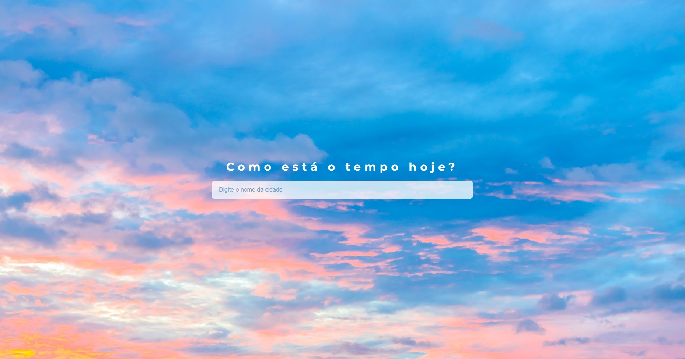

# Weather Checker 🌞👍🏻

<p align="center">

</p>

<p>

</p>
<p>

</p>
&nbsp;
&nbsp;

## Project Description

Web Site to check the weather of the requested city!

## How to run it locally

### Install

Clone this repository and install it dependencies with this command:

```
 npm install
```

### Configure

Create a file .env in the root directory and insert into it two variables:

```
REACT_APP_MAPS_API_KEY = {YOUR_GOOGLE_MAPS_API_KEY}
REACT_APP_WEATHER_API_KEY = {YOUR_OPEN_WEATHER_API_KEY}
```

### Running

Run the application with npm start command, it will start the app on localhost:3000:

```
 npm start
```

## :hammer: Project Functionalities

- `Functionality 1`: Render a input autocomplete from Places API
- `Functionality 2`: Get latitude and longitude of the selected city
- `Functionality 3`: Get weather infos of selected city through latitude and longitude
- `Functionality 4`: Render weather infos and a arrow to go back to the main page

## ✔️ Technologies and techniques used

- `React`
- `Hooks`
- `Axios`
- `Componentization`
